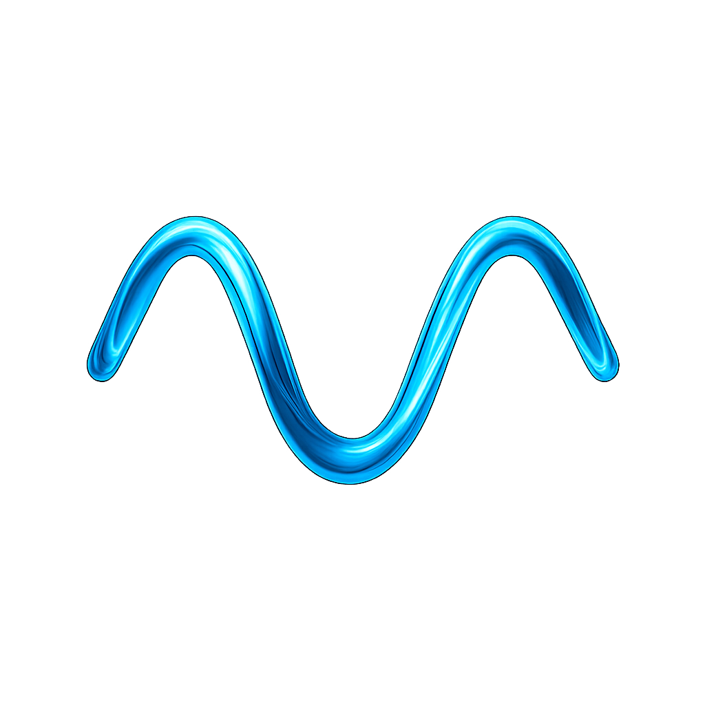

<div align="center">
  <h1 align="center" style="display: flex; align-items: center; justify-content: center; gap: 16px;">
    
    <span><strong>Mnemoverse</strong></span>
  </h1>
  <p><strong>One memory. Every AI tool.</strong></p>
  <p>Persistent memory API for AI agents — write once, recall anywhere.</p>

  [](https://mnemoverse.com/docs/)
  [](https://console.mnemoverse.com)
  [](https://www.npmjs.com/package/@mnemoverse/mcp-memory-server)
  [](https://pypi.org/project/mnemoverse/)
</div>

---

### For AI Agents

Your agent can self-configure by reading our docs in plain text:

```
https://raw.githubusercontent.com/mnemoverse/.github/main/llms.txt
```

This follows the [llms.txt standard](https://llmstxt.org/) — API reference, setup instructions for every tool, and pricing in one file.

---

### What is Mnemoverse

Mnemoverse stores preferences, decisions, lessons, and context — and makes them available across Claude, ChatGPT, Cursor, VS Code, and any tool. One API key, same memories everywhere.

Not a vector database. Memory that learns (Hebbian associations), consolidates (like sleep), and improves over time (feedback loop).

### Get Started

```bash
# Claude Code — one command
claude mcp add mnemoverse -e MNEMOVERSE_API_KEY=mk_live_YOUR_KEY -- npx -y @mnemoverse/mcp-memory-server

# Python — three lines
pip install mnemoverse
```

Get your free API key at [console.mnemoverse.com](https://console.mnemoverse.com) — no credit card, 1,000 queries/day.

### Public Repositories

| Repository | What it does |
|-----------|-------------|
| **[@mnemoverse/mcp-memory-server](https://github.com/mnemoverse/mcp-memory-server)** | MCP server for Claude Code, Cursor, VS Code, Windsurf |
| **[mnemoverse (PyPI)](https://github.com/mnemoverse/mnemoverse-sdk-python)** | Python SDK — sync + async clients with retry and circuit breaker |
| **[mcp-docs-server](https://github.com/mnemoverse/mcp-docs-server)** | MCP server template for documentation access |

### Built on Research

- SLoD framework published on [arXiv:2603.08965](https://arxiv.org/abs/2603.08965)
- Benchmarked on LoCoMo (1,986 questions), HotpotQA, LongMemEval
- 4 provisional patents filed (INPI, 2026)
- NVIDIA Inception Program member

### Links

- [Documentation](https://mnemoverse.com/docs/) — guides, API reference, integration setup
- [Console](https://console.mnemoverse.com) — sign up, API keys, usage dashboard
- [ChatGPT setup](https://mnemoverse.com/docs/api/chatgpt) — Custom GPT with Actions
- [llms.txt](https://raw.githubusercontent.com/mnemoverse/.github/main/llms.txt) — machine-readable docs for AI agents

---

<div align="center">
  <sub>Persistent memory for AI agents | <a href="https://mnemoverse.com">mnemoverse.com</a></sub>
</div>
